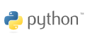
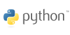

[official Python Logos](http://www.python.org/community/logos/).

[Python trademark policy](http://www.python.org/psf/trademarks/).

The font is [Flux Regular](http://www.myfonts.com/fonts/t26/flux/regular/?refby=hackerlogos).

 

 

 

 
