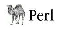

The [offical Perl trademark](http://www.perlfoundation.org/perl_trademark) is an onion.  I have never seen this in the wild: everyone uses the camel, so that's what I used too.

The use of the camel image in association with the Perl language is a trademark of [O'Reilly & Associates, Inc.](http://www.oreilly.com/) Used with permission.

O'Reilly has a [usage overview](http://onlamp.com/pub/a/oreilly/perl/usage/) and [FAQ](http://www.oreillynet.com/lpt/a/3157) that you need to read before using the camel.

The font is [ITC Garamond](http://www.myfonts.com/fonts/itc/garamond/lit/?refby=hackerlogos).  I used a similar free font [Guru](http://www.softerviews.org/Fonts.html) by Bhikkhu Pesala.

 