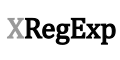
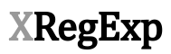

The font is [Cambria Regular](http://www.myfonts.com/fonts/ascender/cambria/regular/?refby=hackerlogos).
The vertical logo also uses [Droid Sans](http://www.myfonts.com/fonts/ascender/droid-sans-pro/bold/?refby=hackerlogos).

 

 

 

 

